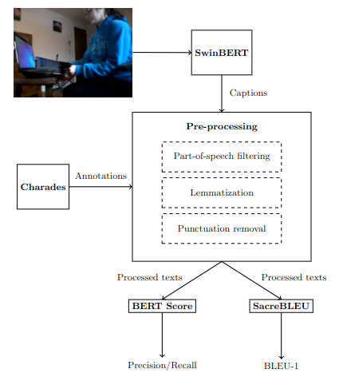

# Indoor Scenes Video Captioning



This repository contains all the resources and evaluation code used in the publication: Indoor scenes video captioning.

In this work is introduced the usage of SwinBERT, a powerful and recent Video Captioning model, over home scenes using different kinds of lexical transformations to maximize the semantic meaning of captions and annotations in order to get more accurate matches from the human perspective judgement. 
It is also used for evaluating the SwinBERT model over the Charades dataset, but any other video dataset can be used for this purpose.

This repository is composed by 4 directories. In `descriptions` you can find scripts which performs the caption extraction using SwinBERT. In `evaluation` you can find the scrips associated to evaluate the obtained captions with respect to the ground-truth annotations of the dataset used. The directory `images` stores the figure present in this file and the directory `results` is an auxiliar folder which keeps temporary files generated by the main scripts.

## Setup environment


The experimentation was fully performed inside 2 Docker containers, one of them for the description generation and the other for the evaluation. 2 containers were used to avoid incompatibilities between used libraries during the evaluation and the ones used inside the descriptions generation container, which was the one given by the SwinBERT authors. The description generator container can be found in the official [SwinBERT publication](https://github.com/microsoft/SwinBERT). To use the scripts provided here inside the SwinBERT docker container you have to copy the scripts in the source work directory of the container. The evaluation container can be run executing the next command in the source directory of this repository:
```
docker run --gpus '"device=0"' --rm -it \
    --volume="$(pwd):/workspace/:rw" \
    --workdir="/workspace" \
    javiro01/swinbert-evaluation bash
```

> In case you have not any GPUs available remove the --gpus flag in the previous command.

In our publication Charades dataset has been used. Video and annotations of this dataset can be downloaded from its [official page](https://prior.allenai.org/projects/charades)


## Captions extraction

> The usage of each of the scripts provided in this repository can be seen at the top of each of them.

For extracting descriptions using SwinBERT model we will use the script `descriptions/test.sh`. The output of this execution will be a file on which in each line you will have the name, ground-truth description and SwinBERT description of the input videos provided. Names used in the code snippets provided are just examples, you can customize them as needed. An example of execution of the previous script can be:

```
bash test.sh 3000 msvd /videocap/videos/ output_msvd.txt
```

This execution will output the captions for the msvd pretraining over a testset of 3000 videos randomly chosen from the dataset selected. For obtaining the captions for these same videos using a different pretraining we can obtain the list of videos running:

```
awk -F, '{print $1}' output_msvd.txt | tail -n +2 > videoslist.txt
```

After this we will use the script `desciptions/reproduce_test.sh` to obtain the captions from a different pretraining. This script should receive from the standard input the list of videos whose descriptions we are interested in. Next an example of execution:

```
cat videoslist.txt > bash reproduce_test.sh 3000 vatex /videocap/videos/ output_vatex.txt
```

## Evaluation

Once we have generated the captions we can evaluate these captions with respect to the ground-truth annotations using the evaluation docker container. Execute the following mentioned scripts from the directory `evaluation` to avoid errors. For evaluation we have used BLEU-1 and BERT Score metrics. In case you want to extract BLEU-1 you will use `evaluation/transform_and_bleu.sh`. This script has as output a file on which each line is composed by the name of a video, its ground-truth annotation, its predicted caption and the BLEU-1 score between the ground-truth and the predicted caption. Additionally it will write in command line the average BLEU-1 for the evaluation. An example of execution of this script can be:

```
bash transform_and_bleu.sh output_vatex.txt vatex bleu_vatex.txt rpl
```

> Last argument you must provide to the script represents the lexical transformations done before evaluation. Available transformations will be explained at the end of the section.

In case you want to extract precision, recall and F1 from BERT Score you must execute the script `evaluation/transform_and_bert.sh`. This script will display in the command line the three metrics. Next an example of execution:
```
bash transform_and_bert.sh output_vatex.txt vatex rpl pvatex.txt avatex.txt
```

### Lexical transformations

Last argument of the scripts `transform_and_bleu.sh` and `transform_and_bert.sh` corresponds to a reference to the transformation done over annotations and predictions before computing the desired metric. 8 lexical transformations are available and are reperesented by the next references:
- "r": Raw. Same as applying no transformation
- "rp": Apply part-of-speech filtering mentioned in the publication
- "rl": Apply lemmatization
- "rpl": Apply lemmatization and part-of-speech filtering
- "p": Apply a punctuation removal
- "pp": Apply punctuation removal and part-of-speech filtering
- "pl": Apply punctuation removal and lemmatization
- "ppl": Apply puncutation removal, lemmatization and part-of-speech filtering
